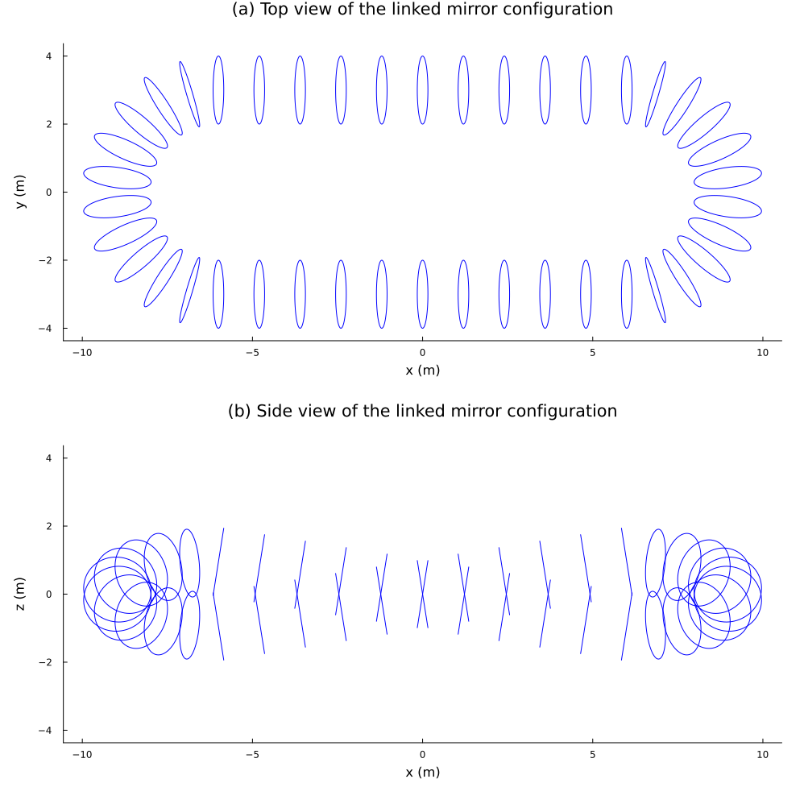
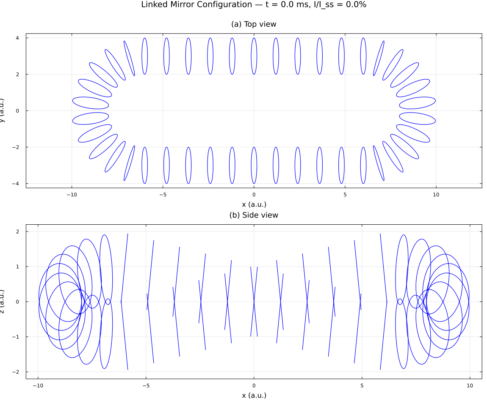
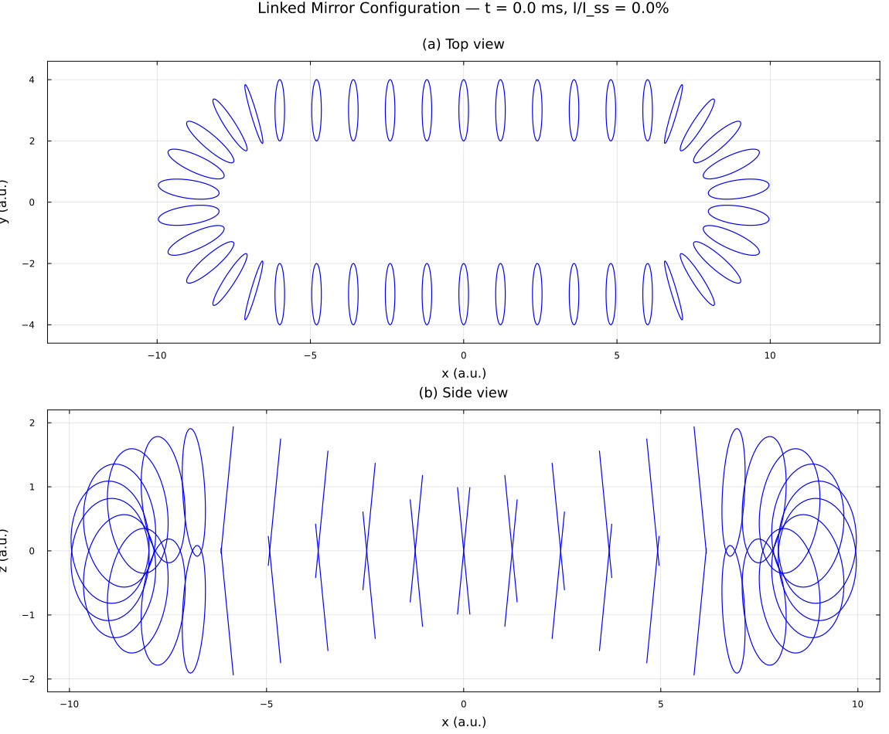
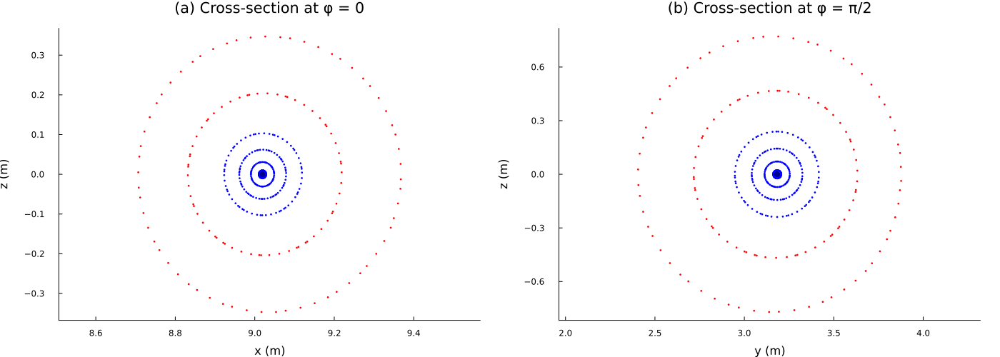
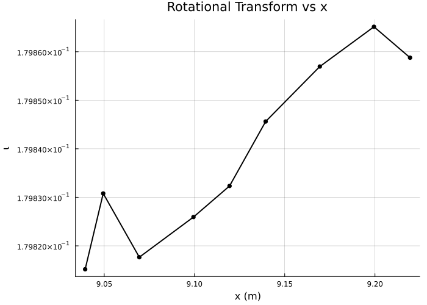
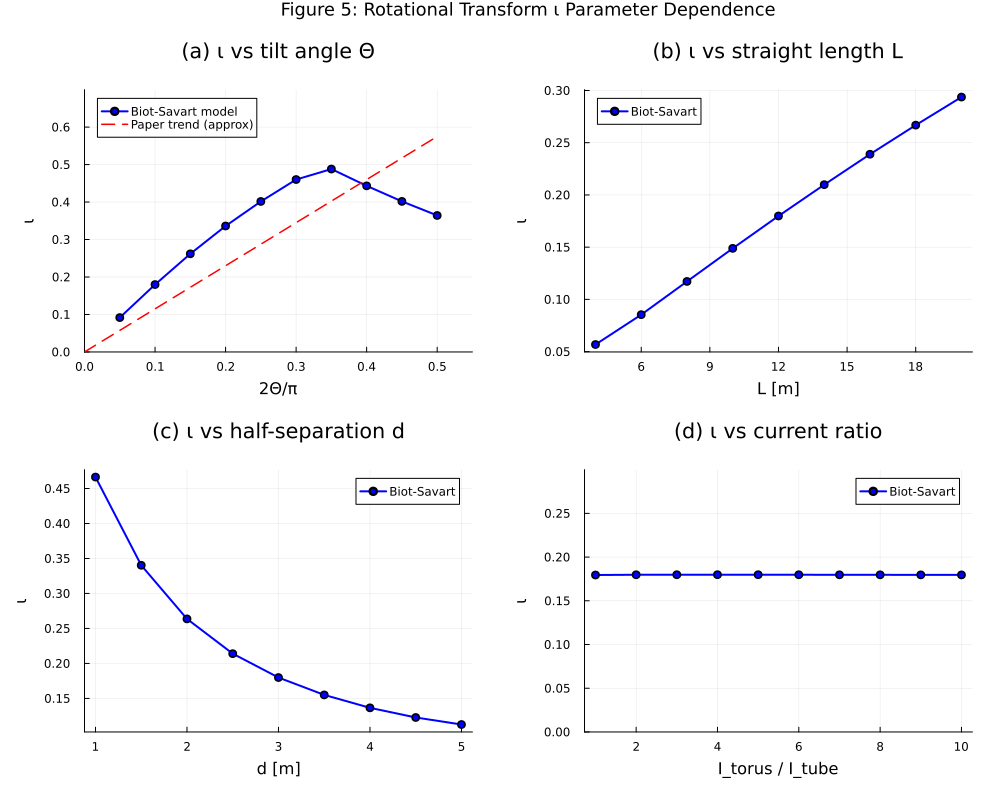

# Test4 — Linked Mirror Configuration (LMC) 磁场仿真与可视化

本项目对 **链式磁镜 / 跑道形线圈阵列（Linked Mirror Configuration, LMC）** 进行建模与可视化。

- **Dyad 模型**（`dyad/`）：将 42 个线圈建成带 RL 电动力学的电路（`Coil` / `LMC_Configuration`），电流按稳态需求逐线圈施加阶跃电压。
- **几何 / 磁场辅助库**（`src/racetrack_helpers.jl`）：在建模时被 Dyad 调用，计算每个线圈的位置、法向、电流，并提供 Biot–Savart 磁场计算 `compute_total_field`。
- **可视化脚本**（`scripts/`）：用 Biot–Savart 定律计算磁场、追踪磁力线、推进带电粒子，生成论文风格的图与动画（几何图、磁面、Poincaré 截面、旋转变换 ι、粒子约束动画等）。

跑道由两段直段（各 11 个线圈）+ 两段半圆段（各 10 个线圈）组成，共 42 个线圈；直段带倾角 Θ，半圆段与直段端部线圈通高电流，直段中部通低电流。

---

## 目录结构

```
dyad/                    Dyad 模型源文件（Coil、LMC_Configuration、CustomCoil 等）
generated/               Dyad 编译产物（只读）
src/
  Test4.jl               包主模块
  racetrack_helpers.jl   跑道几何 + Biot–Savart 磁场（供 Dyad 与部分脚本调用）
scripts/                 磁场后处理与可视化脚本（见下）
test/runtests.jl         运行 Dyad 生成的测试
*.png / *.gif            脚本输出的图与动画（保存在项目根目录）
```

---

## 环境准备

脚本依赖项目环境（`Project.toml`）。首次运行前请实例化依赖：

```bash
cd /path/to/Test4
julia --project=. -e 'using Pkg; Pkg.instantiate()'
```

运行任意脚本的通用方式：

```bash
julia --project=. scripts/<脚本名>.jl
```

在 VS Code 中也可打开脚本后点击 ▶（前提是 Julia 环境已设为 `Test4`）；`plot_particles.jl` 与 `plot_flux_transient.jl` 内部会调用 `Pkg.activate` 自动激活项目环境。

所有输出文件都保存到**项目根目录**（脚本里的 `joinpath(@__DIR__, "..")`）。

---

## scripts 中各文件说明

### `lmc_field_utils.jl` — 共享工具库（不单独运行）

被 `plot_geometry.jl`、`plot_flux_surface.jl`、`plot_poincare.jl`、`plot_rotational_transform.jl`、`plot_figure5.jl` 通过 `include` 引入。提供：

- `CoilSet` 结构体与 `make_coils(; Theta, L, d, r_coil, ratio, ...)`：按可调参数生成跑道线圈阵列。
- `total_B` / `total_B!`：所有线圈在某点的 Biot–Savart 合磁场。
- `trace_field_line`、`trace_crossings`（φ=0 截面）、`trace_crossings_phi90`（φ=π/2 截面）：RK4 磁力线追踪与截面穿越点记录。
- `compute_iota(...)`：通过磁轴查找 + 角度展开线性拟合计算旋转变换 ι。

> 注意：本文件用参数化的 `make_coils` 独立生成几何，与 `src/racetrack_helpers.jl` 是**两套并行的磁场引擎**——引入本文件的脚本走这一套，直接调用 `Test4.compute_total_field` 的脚本走 `src` 那一套。

---

### `plot_geometry.jl` — 图 1：线圈几何（俯视 + 侧视）

将 42 个线圈按其法向投影成椭圆，画出俯视图（x-y）和侧视图（x-z）。

- 依赖：`lmc_field_utils.jl`、`Plots`(gr)
- 运行：`julia --project=. scripts/plot_geometry.jl`
- 输出：`lmc_geometry.png`



---

### `plot_flux_surface.jl` — 磁面参考图（仅线圈几何，俯视 + 侧视）

复现参考图 `lmc_flux_surface.png` 的线圈投影布局（只画几何，不追踪磁力线）。

- 依赖：`lmc_field_utils.jl`、`Plots`(gr)
- 运行：`julia --project=. scripts/plot_flux_surface.jl`
- 输出：`lmc_flux_surface.png`


---

### `plot_flux_surfaces.jl` — 磁面 + RL 暂态动画（CairoMakie）

从中心线附近半径 0.3 m 的圆上取 16 条起点，RK4 追踪磁力线勾勒磁面；再按 RL 暂态 `I(t)/I_ss = 1 − exp(−t/τ)` 让磁面随电流上升逐渐显现，生成动画。使用 `Test4.compute_total_field`。

- 依赖：`Test4`、`CairoMakie`
- 运行：`julia --project=. scripts/plot_flux_surfaces.jl`
- 输出：`lmc_flux_surface.png`（稳态静图，会覆盖上一个脚本的同名文件）+ `lmc_flux_transient.gif`



---

### `plot_flux_transient.jl` — 磁力线随电流上升的暂态动画（Plots）

从 (9,0,0) 附近取 8 条较长磁力线（约绕跑道 2 圈），按 RL 暂态逐帧“生长”显示，附俯视 + 侧视双面板。使用 `Test4.compute_total_field`。

- 依赖：`Plots`(gr)、`Test4`
- 运行：`julia --project=. scripts/plot_flux_transient.jl`
- 输出：`lmc_flux_transient2.gif`



> 注意：脚本顶部的 `using Test4` 目前被注释掉，但代码用 `Test4.` 前缀调用了包函数。若在全新会话中直接运行会报 `UndefVarError: Test4`；请先取消该行注释（或在已 `using Test4` 的会话中运行）。

---

### `plot_poincare.jl` — 图 2：Poincaré 截面（φ=0 与 φ=π/2）

从磁轴外不同偏移追踪 4 条内磁面（蓝）+ 2 条外磁面（红），记录 φ=0 和 φ=π/2 两个截面的穿越点。

- 依赖：`lmc_field_utils.jl`、`Plots`(gr)
- 运行：`julia --project=. scripts/plot_poincare.jl`
- 输出：`lmc_poincare.png`
- 耗时：约 3–4 分钟（6 条磁面 × 2 个截面的长程追踪）



---

### `plot_rotational_transform.jl` — 图 4：旋转变换 ι 随径向位置 x

先迭代求磁轴，再在磁轴外多个径向偏移处追踪磁力线，用角度展开 + 线性拟合求 ι，绘制 ι–x 曲线。

- 依赖：`lmc_field_utils.jl`、`Plots`(gr)
- 运行：`julia --project=. scripts/plot_rotational_transform.jl`
- 输出：`lmc_rotational_transform.png`
- 耗时：约 30 秒



---

### `plot_figure5.jl` — 图 5：ι 对四个参数的依赖关系

分别扫描 (a) 倾角 2Θ/π、(b) 直段长度 L、(c) 半间距 d、(d) 电流比 `I_torus/I_tube`，每个参数点调用 `compute_iota`，绘制 2×2 面板。

- 依赖：`lmc_field_utils.jl`、`Plots`(gr)
- 运行：`julia --project=. scripts/plot_figure5.jl`
- 输出：`lmc_figure5.png`
- 耗时：约 2–3 分钟（约 38 个参数点，每点约 2 秒）



---

### `plot_particles.jl` — 带电粒子约束动画

在稳态磁场中用 Boris 推进器推进 10,000 个 1 keV 测试粒子（默认电子）。粒子沿过 (9.1,0,0) 的磁面均匀发射、各向同性初速度；当小半径达到 0.99 r 视为损失。为加速，先在 3D 网格上预计算磁场再做三线性插值。生成俯视 + 侧视双面板动画，标题显示时间与存活粒子数。

- 依赖：`Test4`、`Plots`(gr)、`Random`
- 运行：`julia --project=. scripts/plot_particles.jl`
- 输出：`particles.gif`
- 说明：粒子质量 / 电荷可在脚本顶部 `PARTICLE_MASS` / `PARTICLE_CHARGE` 处修改以切换粒子种类。


---

### `analysis-notebook.ipynb` — Dyad 分析 Notebook（beta）

用于交互式运行 Dyad 分析（`DyadOrchestrator` 工作流）。在支持 Julia 内核的 Jupyter / VS Code 环境中打开并按序执行单元格。

---

## 输出文件一览

| 脚本 | 输出 |
| --- | --- |
| `plot_geometry.jl` | `lmc_geometry.png` |
| `plot_flux_surface.jl` | `lmc_flux_surface.png` |
| `plot_flux_surfaces.jl` | `lmc_flux_surface.png` + `lmc_flux_transient.gif` |
| `plot_flux_transient.jl` | `lmc_flux_transient2.gif` |
| `plot_poincare.jl` | `lmc_poincare.png` |
| `plot_rotational_transform.jl` | `lmc_rotational_transform.png` |
| `plot_figure5.jl` | `lmc_figure5.png` |
| `plot_particles.jl` | `particles.gif` |
